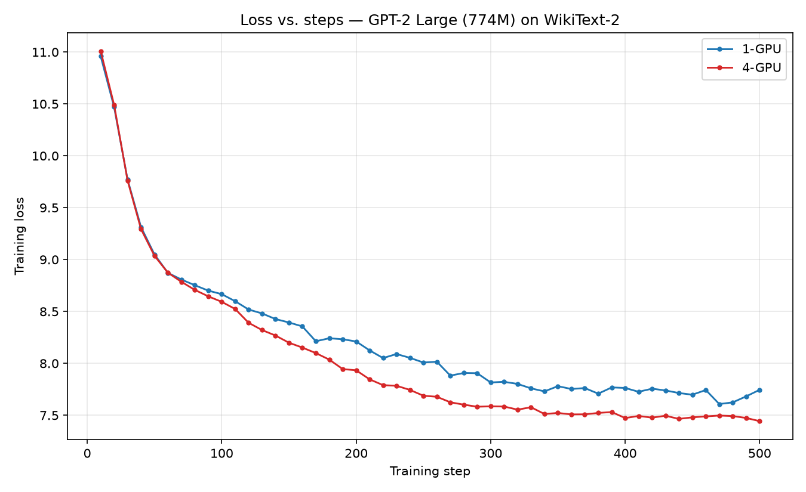
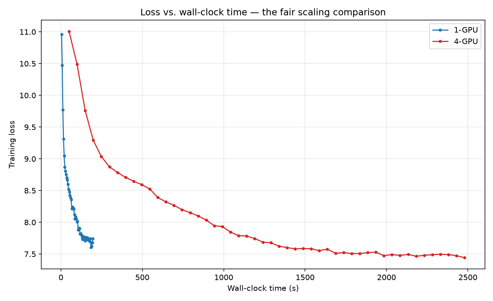

# Scaling LLM Training with PyTorch DDP — Report

**Model:** GPT-2 Large (774M parameters), trained from scratch
**Dataset:** WikiText-2 (`Salesforce/wikitext`, `wikitext-2-v1`)
**Hardware:** Nebius Managed Kubernetes, 4 × NVIDIA H100 80GB SXM (1 GPU per node)
**Orchestration:** SkyPilot on mk8s
**Container image:** `efiradware/nebius-trainer:v1` (NVIDIA NGC PyTorch 25.12 base)

---

## 1. Maximum per-device batch size

**Result: `PER_DEVICE_TRAIN_BATCH_SIZE = 8`**

Found by short probe runs (`MAX_STEPS=20`) on a single H100 with `num_nodes: 1`,
raising the batch size in powers of two until the job failed:

| Batch size | Result | Evidence |
|---|---|---|
| 1 | Ran successfully | `train_runtime` 17.8 s (20 steps) |
| 8 | Ran successfully | `train_runtime` 84.1 s (20 steps), 1.904 samples/s |
| 16 | **OOM** | Failed during step 1 |

Because batch 8 completed, batch sizes 2 and 4 necessarily fit as well and were
not probed separately. Batch 8 was used for both graded runs.

The failure at batch 16:

```
torch.OutOfMemoryError: CUDA out of memory. Tried to allocate 3.07 GiB.
GPU 0 has a total capacity of 79.18 GiB of which 2.17 GiB is free.
Of the allocated memory 72.50 GiB is allocated by PyTorch, and 3.76 GiB is
reserved by PyTorch but unallocated.
```

Notably, the failure happened while computing the loss — inside HuggingFace's
`ForCausalLMLoss`, at the call `logits.float()` — not in the model weights or
the transformer activations. Before computing the loss, the model produces one
score for every vocabulary token, at every position, for every sequence in the
batch — a tensor of shape 16 × 1024 × 50257. This is converted from bf16 to
fp32 for numerical stability, which allocates a new tensor of 3.07 GiB. Only
2.17 GiB was free. The limiting factor is therefore the vocabulary projection:
it grows with batch size, and it is large because GPT-2's vocabulary is 50,257
tokens wide.

Full probe logs: `probe_bs8.txt`, `probe_bs16_oom.txt`.

---

## 2. Model verification — GPT-2 Large

`train.py` was modified to the GPT-2 Large architecture from Table 2 of the
original GPT-2 paper:

```python
config = GPT2Config(
    vocab_size=50257,
    n_positions=1024,
    n_embd=1280,
    n_layer=36,
    n_head=20,
    bos_token_id=50256,
    eos_token_id=50256,
)
```

This satisfies the standard GPT-2 constraint that head dimension stays at 64
(`d_head = n_embd / n_head = 1280 / 20 = 64`). `BLOCK_SIZE` was set to 1024 in
`train_job_ddp.yaml` to match `n_positions`.

Confirmed by the startup line in both logs:

```
[Comm] Trainable parameters: 774,030,080
```

774.0M parameters, matching the ~762M figure reported for GPT-2 Large. Both
runs additionally echo the configuration values from the synced `train.py`
before `torchrun` starts, confirming the correct script reached the pods.

---

## 3. Loss vs. steps



Both curves descend from ~11.0 to the mid-7s over 500 steps. They track each
other closely, with the 4-GPU curve running slightly below the 1-GPU curve from
roughly step 100 onward, ending at 7.44 versus 7.74.

This is expected and is not evidence that DDP helped. At batch 8 per device,
the 4-GPU run has a *global* batch of 32 versus 8 for the 1-GPU run, so it
consumes 4× more data over the same 500 steps. The `epoch` fields in the logs
confirm this directly: the final training-metrics line reports `epoch: 1.695`
for the 1-GPU run and `epoch: 6.757` for the 4-GPU run — a ratio of 3.99 —
since `epoch` counts passes over the dataset consumed. The larger effective batch
yields lower-variance gradient estimates and slightly faster convergence per
step. Steps are not a fair unit of comparison between the two runs, which the time-based plot below addresses.

---

## 4. Loss vs. wall-clock time — the fair comparison



Converting steps to seconds using each run's own `train_runtime` reverses the
picture entirely. The 1-GPU run reaches loss ≈ 7.6 in under 200 seconds. The
4-GPU run needs approximately 2,480 seconds to arrive at a comparable loss.

For any wall-clock budget in this range, the single-GPU configuration reaches a
lower loss than the four-GPU configuration.

---

## 5. Training throughput

| Metric | 1-GPU | 4-GPU |
|---|---|---|
| `train_runtime` (s) | 196.400 | 2,480.000 |
| `train_samples_per_second` | 20.370 | 6.452 |
| `train_steps_per_second` | 2.546 | 0.202 |
| `train_loss` (final) | 8.232 | 8.042 |
| Avg step time from `[Comm]` log (s) | 0.3624 | 4.9307 |

---

## 6. Inference (evaluation) throughput

| Metric | 1-GPU | 4-GPU |
|---|---|---|
| `eval_samples_per_second` | 53.671 | 200.649 |
| `eval_runtime` (s) | 4.639 | 1.241 |
| `eval_loss` | 6.990 | 6.801 |
| `eval_steps_per_second` | 53.671 | 50.767 |

Evaluation throughput improved by **3.74×** on 4 GPUs — 93.5% of ideal linear
scaling.

---

## 7. Communication numbers

| Metric | 1-GPU | 4-GPU |
|---|---|---|
| `world_size` | 1 | 4 |
| Trainable parameters | 774,030,080 | 774,030,080 |
| Theoretical grad payload / step (fp32) | 3,096,120,320 B (3.10 GB) | 3,096,120,320 B (3.10 GB) |
| Theoretical ring all-reduce bytes/GPU/step | 0 | 4,644,180,480 B (4.64 GB) |
| Total measured comm time (s) | 0.0000 | 2,297.7714 |
| Total measured comm bytes | 0 | 1,548,060,160,000 (1.55 TB) |
| Avg comm time per all-reduce call (s) | 0.000000 | 0.042245 |
| Avg comm time per optimizer step (s) | 0.000000 | 4.595543 |

### Derived figures

| Quantity | Value |
|---|---|
| Wall-clock ratio (4-GPU runtime ÷ 1-GPU runtime) | 12.63× longer |
| Throughput ratio (samples/s) | 0.32× (i.e. 3.16× slower per sample) |
| Scaling efficiency vs. ideal 4× | 7.9% |
| Measured comm time as share of 4-GPU runtime | 92.7% |
| Implied compute time per step (4.9307 − 4.5955) | ≈ 0.335 s |
| Effective interconnect bandwidth (4.64 GB ÷ 4.596 s) | ≈ 1.01 GB/s (≈ 8 Gbit/s) |

### A note on the measured byte count

The measured total (1.55 TB) is lower than the theoretical total
(500 steps × 4.64 GB = 2.32 TB) because the two figures count different things.
The timed communication hook measures each gradient bucket's buffer once —
1,548,060,160,000 B ÷ 500 steps = 3.10 GB per step, exactly the *logical*
gradient payload. The theoretical figure accounts for the ring all-reduce
algorithm moving 2(N−1)/N × payload on the wire. Multiplying the measured
payload by 1.5 recovers the physical traffic. The *timing* measurements are
unaffected, since the CUDA events wrap the complete operation regardless of how
many bytes cross the wire internally.

---

## 8. Did DDP improve performance?

**No — for training. Yes — for inference.** The measured communication numbers
account for the difference completely.

### Training

Per-sample throughput fell from 20.370 to 6.452 samples/second, a **3.16×
regression**. In raw wall-clock terms the 4-GPU run took 12.63× longer to
complete 500 steps, though that figure overstates the penalty somewhat because
the 4-GPU run also processed 4× more data over those steps. Either way, adding
three GPUs made training slower rather than faster. Scaling efficiency against
ideal 4× linear scaling is **7.9%**.

The cause is visible directly in the `[Comm]` instrumentation:

| Component of a 4-GPU step | Time |
|---|---|
| Gradient all-reduce (measured) | 4.596 s |
| Everything else (implied compute) | 0.335 s |
| Total step time | 4.931 s |

Communication consumes **92.7%** of the entire run. The implied compute time of
0.335 s closely matches the 1-GPU step time of 0.362 s, confirming that
per-device computation was unaffected — the GPUs themselves performed normally,
and the entire regression is attributable to gradient synchronization.

### Why communication is this expensive

Two factors compound.

**The payload is large.** Every optimizer step must all-reduce one gradient per
parameter: 774,030,080 × 4 bytes = 3.10 GB. The ring all-reduce algorithm turns
this into 2 × (4−1)/4 × 3.10 GB = **4.64 GB of traffic per GPU per step**. This
volume is irreducible under ring all-reduce, which is bandwidth-optimal — no
algorithm moves less.

**The interconnect is slow.** NCCL's own initialization output identifies the
transport explicitly:

```
NCCL INFO NET/IB : No device found.
NCCL INFO NET/Socket : Using [0]eth0:10.32.21.96<0>
NCCL INFO Using network Socket
NCCL INFO NET/Socket : GPU Direct RDMA Disabled for HCA 0 'eth0'
```

No InfiniBand device is present, so NCCL falls back to TCP sockets over `eth0`,
and GPUDirect RDMA is unavailable — gradients must be staged through host
memory rather than moving GPU-to-GPU directly. The node group uses the
single-GPU H100 preset, which provides no InfiniBand fabric; the "H100 NVLink"
platform name refers to intra-node GPU interconnect that a one-GPU-per-node
topology never exercises.

Dividing measured bytes by measured time gives an effective bandwidth of
**≈ 1.01 GB/s (≈ 8 Gbit/s)** — consistent with commodity TCP Ethernet, and
roughly two orders of magnitude below the ~400 GB/s that NVLink would provide
within a single node.

### Why inference behaves oppositely

Evaluation scaled at **3.74× (93.5% efficiency)** on the same four GPUs, the
same network, the same model, and the same data sharding.

The single difference is that `trainer.evaluate()` runs forward-only under
`torch.no_grad()`. No gradients are produced, so no all-reduce fires. Each rank
scores its own disjoint shard of the validation set independently, and the only
inter-rank communication is a trivial reduction of scalar loss values at the
end.

This is effectively a controlled experiment embedded in the assignment. Two
workloads on identical hardware differ in exactly one variable — whether
gradients are synchronized — and their scaling efficiencies differ by more than
an order of magnitude (7.9% vs 93.5%). No factor other than gradient
communication can explain the training regression.

### Where the gap from ideal 4× comes from

Ideal linear scaling assumes zero coordination cost. Here the coordination cost
per step (4.596 s) exceeds the computation it coordinates (0.335 s) by a factor
of **13.7**. Two thresholds follow from the measurements:

- **Break-even with a single GPU.** A 4-GPU step processes 32 samples versus 8,
  so it may take up to 4 × 0.362 s ≈ 1.45 s and still match single-GPU
  throughput. With 0.335 s of compute, that leaves a communication budget of
  ≈ 1.11 s — requiring a **~4.1×** improvement in effective communication
  throughput over the measured 4.596 s.
- **Near-linear scaling.** For the all-reduce to hide almost entirely behind
  the backward pass, communication must drop below compute time (≈ 0.335 s) —
  a **~13.7×** improvement.

TCP at ≈ 1 GB/s clears neither bar; InfiniBand at 200 Gbit/s (~25 GB/s) clears
both with a wide margin.

Note also that gradient bucketing already provides what overlap it can: DDP
issues an all-reduce as soon as a ~25 MB bucket fills rather than waiting for
the backward pass to complete. The log implies ~109 all-reduce calls per step
(4.596 s ÷ 0.042245 s), against ~124 expected from dividing the 3.10 GB payload
by the 25 MB default — the difference reflects DDP's actual bucket packing,
which groups whole parameter tensors and so does not divide evenly. But overlap
can only hide communication behind computation that is still running, and with
only 0.335 s of compute available to hide 4.596 s of communication, the great
majority remains exposed.

---

## 9. Options for improvement

Each option below is tied to the measured figures in §7.

### 1. Faster interconnect (largest single win)

At ≈ 1.01 GB/s, moving 4.64 GB costs 4.596 s per step. An InfiniBand fabric at
200 Gbit/s (~25 GB/s) would reduce this to roughly **0.19 s** — below both the
break-even budget (≈ 1.11 s) and the compute time (≈ 0.335 s), at which point
bucketed overlap could hide most of it and DDP would deliver near-linear
speedup. This is the direct fix for the `NET/IB : No device found.` condition.

### 2. Multiple GPUs within a single node

Eight H100s in one chassis communicate over NVLink at ~400–450 GB/s. The same
4.64 GB would transfer in roughly **10 ms** instead of 4.6 s. The Nebius
8-GPU H100 preset provides both NVLink internally and InfiniBand between nodes.
This is the standard production topology and would change the result
qualitatively rather than incrementally.

### 3. Gradient compression

Registering `bf16_compress_hook` halves the payload from 3.10 GB to 1.55 GB,
cutting communication to roughly **2.3 s per step**. The code already
demonstrates the mechanism — `register_comm_hook` is used for the timing
instrumentation — so this is a small change at the same call site. Halving the
cost is meaningful but does not by itself break even, since ≈ 2.3 s still
exceeds the ≈ 1.11 s break-even communication budget derived in §8.

### 4. Gradient accumulation

Setting `GRADIENT_ACCUMULATION_STEPS=8` performs eight forward/backward passes
before each all-reduce. The 4.596 s cost is then amortized across eight
micro-batches — roughly **0.57 s per micro-batch** — because communication
frequency, not communication volume per sync, is what drops. The trade-off is a
proportionally larger effective batch size and fewer optimizer updates for the
same amount of data.

### 5. Larger per-device batch size

Communication cost per step is fixed at 3.10 GB regardless of batch size, since
it depends only on parameter count. Raising the batch therefore increases
compute per step without increasing communication, improving the ratio directly.
Batch 16 was not reachable here (§1), but enabling
`gradient_checkpointing=True` would trade recomputation for activation memory
and free enough headroom to reach it — with the fp32 logits upcast, the specific
allocation that failed, being the constraint to work around.

### 6. Bucket size tuning

The log implies ~109 all-reduce calls per step at 0.042245 s each, broadly
consistent with the 25 MB default bucket size (which would nominally give ~124).
Increasing `ddp_bucket_cap_mb` to 100 would produce roughly 31 larger transfers, reducing per-call latency overhead and
improving bandwidth utilization on large messages. The counter-effect is coarser
granularity and therefore less opportunity to overlap with the backward pass —
though with compute at only 7% of step time, there is little overlap to lose,
which makes larger buckets more attractive here than in a compute-bound setup.

### 7. Sharded training (FSDP / ZeRO)

FSDP shards parameters, gradients, and optimizer states across ranks rather than
replicating them. Total communication volume is comparable to DDP's, so this
would not fix the bandwidth problem directly. Its value here is memory: with
optimizer states sharded four ways, substantially larger per-device batches
become feasible, improving the compute-to-communication ratio via option 5. Most
impactful at scales where the model no longer fits on one device, which is not
the binding constraint at 774M parameters on an 80 GB H100.

### Summary

The measurements point at one dominant cause. Options 1 and 2 address it
directly by changing the interconnect; options 3–6 mitigate it by reducing bytes
moved, reducing synchronization frequency, or increasing the work done per
synchronization. On this hardware, no configuration change short of a faster
interconnect makes 4-node DDP outperform a single H100 for this model.

---

## Appendix — configuration

Both runs used identical settings apart from `num_nodes`:

```yaml
envs:
  TRAIN_SCRIPT: "train.py"
  MAX_STEPS: "500"
  BLOCK_SIZE: "1024"
  PER_DEVICE_TRAIN_BATCH_SIZE: "8"
  PER_DEVICE_EVAL_BATCH_SIZE: "1"
  GRADIENT_ACCUMULATION_STEPS: "1"
  DATALOADER_NUM_WORKERS: "4"
  TOKENIZERS_PARALLELISM: "false"
  NCCL_DEBUG: INFO
  NCCL_DEBUG_SUBSYS: INIT,NET
```

| File | Contents |
|---|---|
| `mk8s-ng-config.json` | Node-group export: 4 nodes, `gpu-h100-sxm`, public IPv4, `node-sa` |
| `logs/1gpu_log.txt` | Full 1-GPU run log |
| `logs/4gpu_log.txt` | Full 4-GPU run log, including `[NCCL]` initialization |
| `config/train_job_1gpu.yaml` | SkyPilot spec, `num_nodes: 1` |
| `config/train_job_4gpu.yaml` | SkyPilot spec, `num_nodes: 4` |
| `probe_bs8.txt`, `probe_bs16_oom.txt` | Batch-size probe evidence |
| `graphs/` | Loss-vs-steps and loss-vs-time plots |
| `parse_logs.py` | Log parser used to generate tables and graphs |
